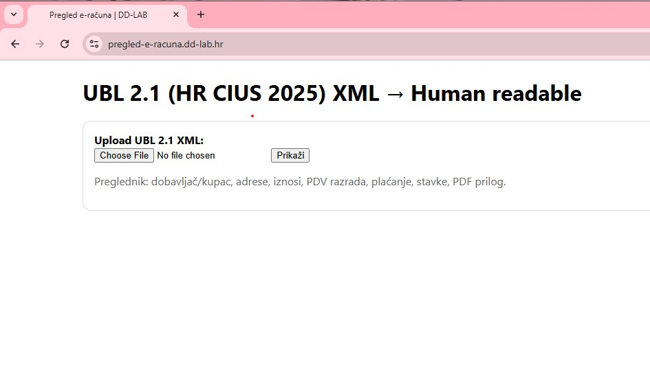
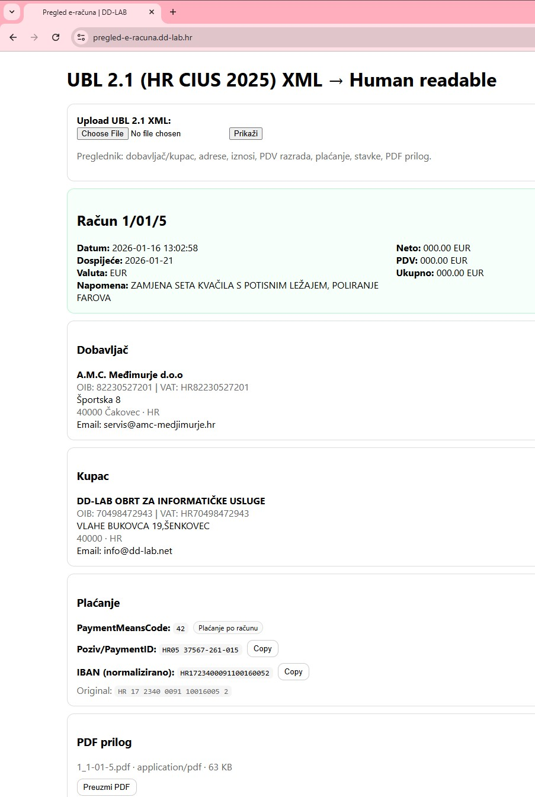

# Pregled e-računa (UBL 2.1)

Jednostavna PHP web aplikacija za **pregled i vizualizaciju e-računa (UBL 2.1 XML)** dokumenata.  
Aplikacija omogućuje čitanje osnovnih podataka, stavki računa te preuzimanje izvornog PDF-a (ako je uključen kao Base64).

## Funkcionalnosti
- Učitavanje UBL 2.1 XML e-računa
- Prikaz:
  - kupca i dobavljača
  - zaglavlja računa
  - stavki i iznosa
- Automatsko prepoznavanje Base64 PDF-a
- Preuzimanje PDF-a iz XML-a
- Jednostavan HTML prikaz bez baze podataka

## Tehnologije
- PHP 8+
- HTML / CSS
- UBL 2.1 XML

## 🚀 Pokretanje
1. Kloniraj repozitorij:
   ```bash
   git clone https://github.com/dklobucaric/pregled-e-racuna.git
2. Postavi projekt u web root (Apache / Nginx)
3. Otvori u browseru: http://localhost/pregled-e-racuna

Nema potrebe za bazom podataka niti dodatnim ekstenzijama.

## Screenshots



## Live site
https://pregled-e-racuna.dd-lab.hr/

## Licenca
Koristi, mijenjaj i dijeli kako god želiš.  
Cilj projekta je da ti **olakša život**, ništa više, ništa manje.

Detalji su u [LICENSE](LICENSE) datoteci.

— Dalibor Klobučarić
